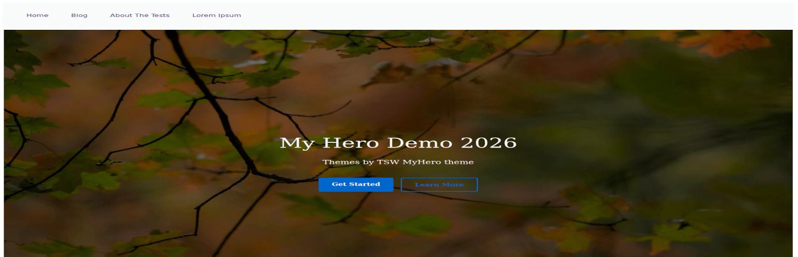

# MyHero
ClassicPress theme with full Above the Fold hero. Uses image or video as hero.

Requires PHP: 8.1

Requires CP:  2.0

Version:      1.0.0

Author:       Tradesouthwest

Tags:         featured-images, threaded-comments, full-width-template

License:      GNU General Public License v3.0

License URI:  https://www.gnu.org/licenses/gpl-3.0.en.html

Text domain:  myhero

URI:          [https://github.com/tradesouthwest/myhero](https://github.com/tradesouthwest/myhero)

## Description: 
MyHero theme provides the following features:

- Full sized ATF hero on front-page.
- Lesser banner on all other pages.
- Custom breadcrumbs.
- Background color.
- Primary Button Text.
- Secondary Button Text.
- Both can save a url.
- Set image for hero.
- Or set mp4 media file (video).
- Set banner image for other pages.
- Custom logo placement.

Demo at https://themes.classicpress-themes.com/myhero

